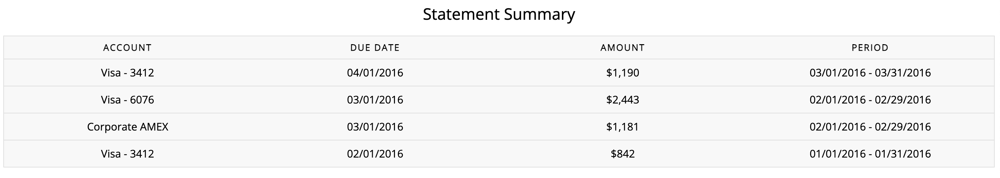
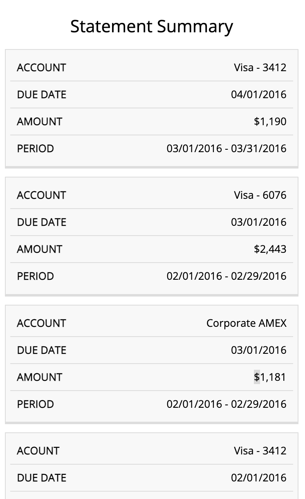

# Ejercicios Javascript repaso. Todo mezclado.

## Instrucciones

Todos los ejercicios tenéis que hacerlos sobre el mismo proyecto de web (misma carpeta html,css y Jsvascript). 

Los ejercicios **tenéis que ir subiéndolos a Github** Conforme terminéis un ejercicio quiero ver un commit que indique algo similar a:

``` Finalizado ejercicio X```

para luego ver comentarios y las soluciones diversas que aportáis, puesto que como dijimos el otro día cada uno programamos de una forma y tenemos varias formas de resolver el mismo problema.

Los ejercicios no son complicados. Empiezan con un poco de HTML básico y luego va escalando hasta que viene Javascript con un poco de DOM y algo de Objetos con API. 

Con lo que habéis visto hasta ahora (y paciencia) podíes sacarlos. No os agobiéis que podéis con esto y con otros ejercicios más complicados de sobra.

### Ejercicio 1


Vamos a crear una simple página HTML donde podemos visualizar una tabla con un botón de forma que ese botón permite agregar filas a esa tabla.


Nuestra tabla tiene que tener las columnas:
- Título
- Autor
- Contenido


### Ejercicio 2


La tabla anterior **tiene que ser responsive** para que se adapte a los móviles y/o tablets. Un ejemplo de una tabla que es responsive puede ser la siguiente.






**!!!!** Para este ejercicio no hace falta utilizar bootstrap ni nada por el estilo, podés sacarlo utilizando exclusivamente medidas relativas (%, em, rem). Sin embargo, si queréis podéis utilizarlo (o hacer dos versiones) para practicar ambas cosas.


### Ejercicio 3


A la página anterior agregar un navbar. Este navbar tiene que ser responsive. Aquí la parte de Javascript que tenemos es la parte de manejar el botón del navbar cuando hace click mostrar (o no) el menú en la parte responsive.


- [ ] El navbar tiene que estar aunque no sea responsive


**Si lleváis mucho tiempo con el responsive y no lo conseguís (cosa que no creo porque sois unos fieras) avanzad con el resto**


### Ejercicio 4


Tenemos que agregar un botón que despliegue un modal (veréis si åbuscais modal que directamente sale bootstrap, podemos con HTML sin necesidad de bootstrap, buscad esta alternativa que luego os preguntaré), el cual contendrá un formulario con un botón de enviar.


Este formulario tiene que tener:
  
   - Título
   - Autor
   - Contenido


### Ejercicio 5


En el formulario anterior tenemos que crear un botón que permita recoger los datos del formulario para "enviarlos".


### Ejercicio 6 - Comienza el reto JS -


Hasta ahora hemos creado sencillas partes de lo que corresponde con un blog muy básico. Para poder manejar las información que contendrá nuestro blog simple. Vamos a crear algo de inteligencia. Para esto tenemos que definir los objetos en Jasvascript de :


   - Entrada : Objeto que representa cada una de las entradas ( fila de nuestra tabla del blog )
   - Autor : Datos muy básicos del autor (que estará dentro de nuestra entrada: Nombre, Apellidos y Nickname (que será el que se muestre como autor)


### Ejercicio 7


Con esa estructura de objetos tenéis que hacer una llamada a esta API. [DumyJson](https://dummyjson.com/) Para traeros los objetos de los POSTS. Esto es una **Sencilla llamada GET** que habéis visto de sobra y podéis hacer sin problema. Con la respuesta de esta llamada la idea es que utiliceis los objetos que habéis creado anteriormente para crear una lista de entradas para el blog con contenido.


PD: La API devuelve un id (número entero) como usuario en lugar de un nombre. Os reto a que creeis una lista (pequeña 2 o 3 elementos) y que en el campo de autor seleccionemos uno simple.


### Ejercicio 8


Con esa lista que hemos obtenido, al finalizarla, podéis utilizar la API DOM para alterar la estructura inicial de la tabla agregando filas con cada uno de los POSTS.


### Ejercicio 9


(Recordáis el ejercicio 5 del formulario). Pues a ese botón (utilizando la API DOM de eventos) tenemos que agregar un evento que maneje que pasan con los datos cuando hacemos un click en el botón de enviar. El resultado que queremos es:


   1. Usuario rellena el formulario
   2. El usuario pulsa el botón
   3. El contenido del formulario pasa a crear un objeto nuevo de entrada
       3.1 Tened en cuenta que el campo "Autor" del formulario será un objeto Autor
       3.2 Título y Contenido será parte del objeto Entrada
       3.3 Una entrada contiene un objeto Autor.
       PD: __ Suena complicado pero es poner atributos en objetos __
   4. Esa entrada creada se agregará a la lista de entradas de nuestra API y a la tabla que existe.


### Ejercicio 10


Con la API DOM (y dándole un par de vueltas) poned un botón en cada una de las filas de la tabla que permita eliminar el contenido de esa fila.


**Este es verdad que es de darle al coco y se complica un poco la historia pero si lo entendéis es muy simplón**

